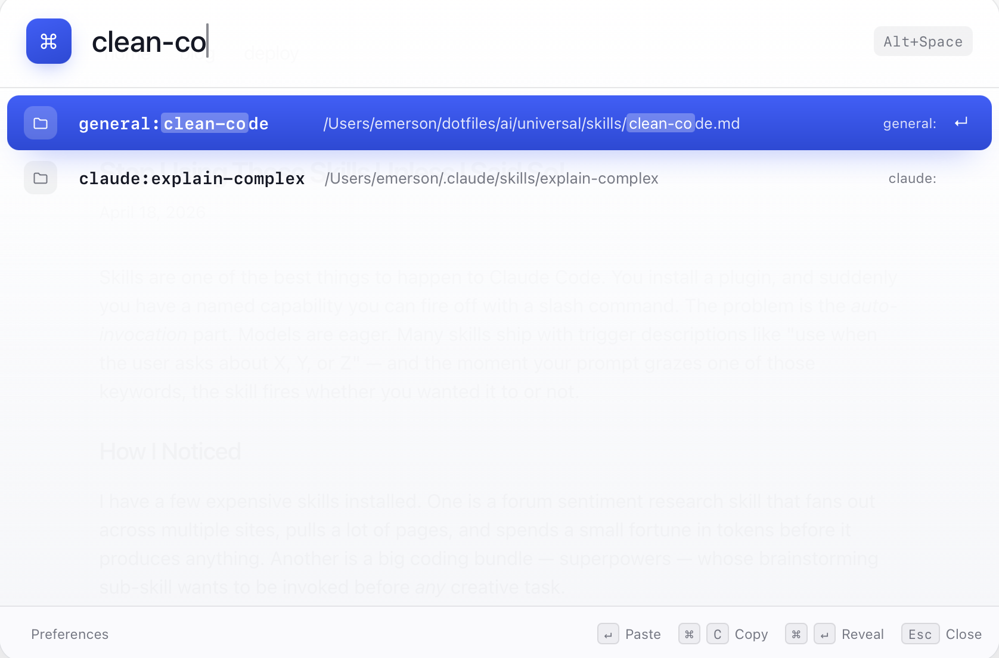
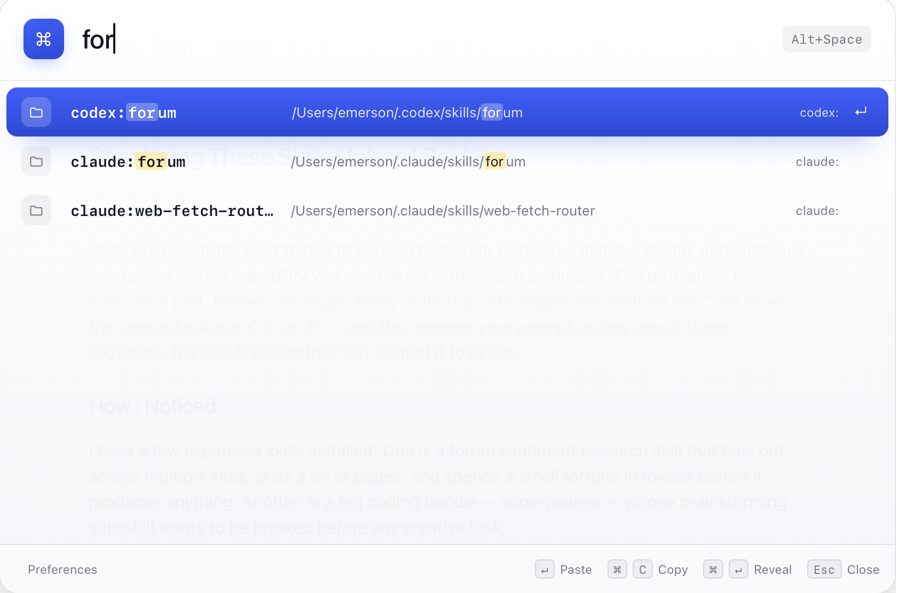
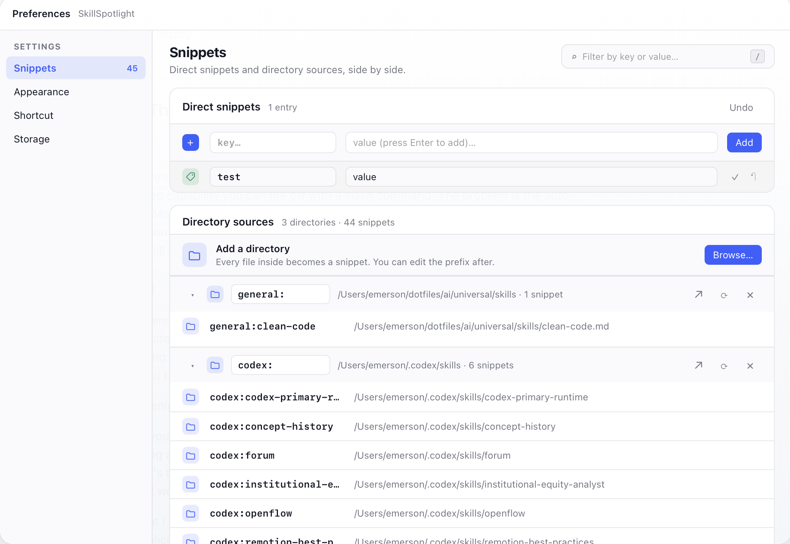

# SkillSpotlight

Use skills explicitly, anywhere you can type.

SkillSpotlight is a macOS snippet launcher and universal skill manager for skills, prompts, commands, and reusable text. Collect skills from Claude Code, Codex, team repositories, personal prompt folders, and other agent platforms into one searchable place. Open it with a global shortcut, type a few characters, then paste, copy, or reveal the matching entry without leaving your current workflow.

Add a direct snippet like `foo` -> `bar`, search for `foo`, press `Enter`, and SkillSpotlight inserts `bar` into the focused window. Or import a directory, such as `~/.claude/skills`, and SkillSpotlight turns the files inside it into searchable entries. Optional prefixes like `claude:` or `codex:` make each source clear in results.



## Installation

1. Download the DMG, open it, and drag `SkillSpotlight.app` to `/Applications`.
2. If macOS blocks the unsigned app, run:

```bash
xattr -dr com.apple.quarantine /Applications/SkillSpotlight.app
```

3. Open SkillSpotlight from `/Applications`.

## macOS Permissions

SkillSpotlight asks for system access when a feature needs it:

- Accessibility: requested on app startup when missing. Paste mode needs it to return focus to the previous app and send `Cmd+V`; without it, pressing `Enter` or clicking a search result may copy the snippet to the clipboard but fail to insert it into the target app. Copy mode still works without it.
- Automation/System Events: macOS may ask for this when SkillSpotlight activates the previous app or asks System Events to paste.
- Files and Folders: used when you import a skill directory, reveal a source file, or reveal the config file. SkillSpotlight reads the directories you choose and stores config locally.
- Clipboard: used to copy snippets and to paste by temporarily placing the selected snippet on the clipboard.

Full Disk Access is not required unless you choose to import a macOS-protected directory that the system blocks.

## Why This App

Many skills are most useful when invocation is intentional. They can be expensive, slow, opinionated, or disruptive outside the workflow they were designed for. A deep-research skill, for example, can be valuable when you explicitly want deep research, but noisy when an agent reaches for it during a quick search or lightweight coding task.

Claude Code and Codex have improved this by adding ways to control implicit skill triggering, but that configuration does not exist in every agent system. Even when it does, managing the same skills across platforms is still tedious. A common workaround is to symlink or copy skill directories between tools. SkillSpotlight gives you a universal control point: collect your skill libraries once, search them quickly, and explicitly inject the exact skill prompt into any system, including AI agent CLIs, desktop apps, editors, terminals, chat windows, or new agent platforms.

## What It Does

- Opens a Spotlight-style launcher from a global shortcut.
- Searches direct snippets and directory-backed snippets in the same result list.
- Acts as a universal skill manager for Claude Code, Codex, team, personal, and other platform skill libraries.
- Imports skill directories with prefixes like `claude:`, `codex:`, and `team:` so each snippet's source is visible in its name.
- Supports fuzzy matching, highlighted matches, keyboard navigation, and mouse selection.
- Pastes the selected snippet, copies it to the clipboard, or reveals the source file.
- Provides preferences for snippets, directory sources, theme, shortcut, and storage.

## Usage

1. Start SkillSpotlight and press the configured global shortcut. The default is `Alt+Space`.
2. Type part of a snippet key, source prefix, or filename.
3. Use `ArrowUp` and `ArrowDown` to choose a result.
4. Press `Enter` to paste the selected snippet into the active app.
5. Press `Cmd+C` to copy the snippet instead.
6. Press `Cmd+Enter` to reveal the source file in Finder.
7. Press `Esc` to close the launcher.

The launcher searches across direct snippets and imported directories. Directory snippets use their configured prefix, such as `claude:review`, `codex:forum`, or `general:clean-code`, so related snippets stay grouped while still being searchable by the final filename. Because SkillSpotlight pastes plain text into the active app, the same managed skill can be used anywhere you can type: an AI agent CLI, a desktop chat app, a browser, a code editor, or a terminal.



## Adding Snippets

SkillSpotlight supports two kinds of snippets.

Direct snippets are best for short reusable text that you manage inside the app. Open Preferences, go to Snippets, enter a key and value, then add it. For example, a key like `email-signoff` can paste your preferred sign-off, or `review-note` can paste a common code review comment.

Directory snippets are best for existing skill libraries or prompt folders. Add directories from Claude Code, Codex, other AI agent platforms, team repositories, or personal collections; choose a prefix for each source; and each supported file becomes a searchable snippet.

## Preferences

Open Preferences from the launcher footer or with `Cmd+,`.

In the Snippets tab, add one-off direct snippets or import a directory. Every supported file in an imported directory becomes a snippet, and the directory prefix can be edited after import.



Other preference tabs let you:

- switch between light and dark themes
- record a different global shortcut
- inspect, reveal, and reload the local config file

## Development

Requirements:

- macOS
- Node.js 20+
- Rust/Cargo

Install dependencies:

```bash
npm install
```

Run the desktop app in development:

```bash
npm start
```

Run the frontend-only dev server:

```bash
npm run dev:frontend
```

Run checks and tests:

```bash
npm run check
npm test
npm run test:e2e
```

Build the macOS app and DMG:

```bash
npm run build
```

Build artifacts are written under:

```text
src-tauri/target/release/bundle/
```

## Config

SkillSpotlight stores its default config at:

```text
~/Library/Application Support/skill-spotlight/config.json
```

Use `SS_CONFIG_PATH` for isolated development or testing.

## Naming

Use `SkillSpotlight` for the visible app name. For package names, binary names, repository slugs, and CLI-style references, `skill-spotlight` is easier to scan than a camel-case form and matches common command-line naming conventions.

## Release

See `RELEASE.md` for the release checklist and artifact verification steps.
